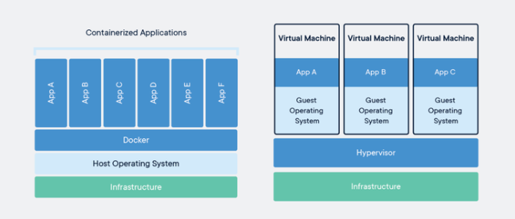

# tech201_Docker

## Why use Docker

Docker is similar in concept to Virtual Machines, except it’s much more lightweight. Instead of running an entire separate operating system (which is a massive overhead), Docker runs containers, which use the same host operating system, and only virtualize at a software level. Companies that use docker include ADP, Spotify and ING



Docker takes the same kind of version control and packaging that tools like Git and NPM provide and allows you to use it for your server software. Since your container is a single image, it makes it very easy to version track different builds of your container. And since everything is contained, it makes managing all of your dependencies much easier.

### Advantages of Docker
- Efficiency , container images can be used at every step of the deployment process
- Compatibility and maintainaility , docker images will run the same on different servers and laptops. less time wasted setting up environments.
- Simplicity , Code for configurations can easily be deployed
- Rapid deployments in seconds, container for each process and does not boot an operating system
- Continuous deployment and testing, consistent environments
- Multi-Cloud platforms, docker has high availability.
- Isolation of each containers contents and resources, this also ensures security.


## Installing Docker

Firstly you can install docker from dockers website, after this has been downloaded use the following commands and then then in order to check this is working type version and run hello-world.
https://docs.docker.com/desktop/install/windows-install/
```
"Docker Desktop Installer.exe"
Start-Process 'Docker Desktop Installer.exe' -Wait install
start /w "" "Docker Desktop Installer.exe" install

docker --version
docker run hello-world
```

## Docker commands

Simply by typing docker you can get a list of usefull commands

```
docker
```

```
Options:
      --config string      Location of client config files (default
                           "C:\\Users\\James_Cole\\.docker")
  -c, --context string     Name of the context to use to connect to the
                           daemon (overrides DOCKER_HOST env var and
                           default context set with "docker context use")
  -D, --debug              Enable debug mode
  -H, --host list          Daemon socket(s) to connect to
  -l, --log-level string   Set the logging level
                           ("debug"|"info"|"warn"|"error"|"fatal")
                           (default "info")
      --tls                Use TLS; implied by --tlsverify
      --tlscacert string   Trust certs signed only by this CA (default
                           "C:\\Users\\James_Cole\\.docker\\ca.pem")
      --tlscert string     Path to TLS certificate file (default
                           "C:\\Users\\James_Cole\\.docker\\cert.pem")
      --tlskey string      Path to TLS key file (default
                           "C:\\Users\\James_Cole\\.docker\\key.pem")
      --tlsverify          Use TLS and verify the remote
  -v, --version            Print version information and quit

Management Commands:
  builder     Manage builds
  buildx*     Docker Buildx (Docker Inc., v0.10.3)
  compose*    Docker Compose (Docker Inc., v2.15.1)
  config      Manage Docker configs
  container   Manage containers
  context     Manage contexts
  dev*        Docker Dev Environments (Docker Inc., v0.1.0)
  extension*  Manages Docker extensions (Docker Inc., v0.2.18)
  image       Manage images
  manifest    Manage Docker image manifests and manifest lists
  network     Manage networks
  node        Manage Swarm nodes
  plugin      Manage plugins
  sbom*       View the packaged-based Software Bill Of Materials (SBOM) for an image (Anchore Inc., 0.6.0)
  scan*       Docker Scan (Docker Inc., v0.25.0)
  scout*      Command line tool for Docker Scout (Docker Inc., v0.6.0)
  secret      Manage Docker secrets
  service     Manage services
  stack       Manage Docker stacks
  swarm       Manage Swarm
  system      Manage Docker
  trust       Manage trust on Docker images
  volume      Manage volumes

Commands:
  attach      Attach local standard input, output, and error streams to a running container
  build       Build an image from a Dockerfile
  commit      Create a new image from a container's changes
  cp          Copy files/folders between a container and the local filesystem
  create      Create a new container
  diff        Inspect changes to files or directories on a container's filesystem
  events      Get real time events from the server
  exec        Run a command in a running container
  export      Export a container's filesystem as a tar archive
  history     Show the history of an image
  images      List images
  import      Import the contents from a tarball to create a filesystem image
  info        Display system-wide information
  inspect     Return low-level information on Docker objects
  kill        Kill one or more running containers
  load        Load an image from a tar archive or STDIN
  login       Log in to a Docker registry
  logout      Log out from a Docker registry
  logs        Fetch the logs of a container
  pause       Pause all processes within one or more containers
  port        List port mappings or a specific mapping for the container
  ps          List containers
  pull        Pull an image or a repository from a registry
  push        Push an image or a repository to a registry
  rename      Rename a container
  restart     Restart one or more containers
  rm          Remove one or more containers
  rmi         Remove one or more images
  run         Run a command in a new container
  save        Save one or more images to a tar archive (streamed to STDOUT by default)
  search      Search the Docker Hub for images
  start       Start one or more stopped containers
  stats       Display a live stream of container(s) resource usage statistics
  stop        Stop one or more running containers
  tag         Create a tag TARGET_IMAGE that refers to SOURCE_IMAGE
  top         Display the running processes of a container
  unpause     Unpause all processes within one or more containers
  update      Update configuration of one or more containers
  version     Show the Docker version information
  wait        Block until one or more containers stop, then print their exit codes
```

## Login

Login to docker 

```
docker login
```
## Running a new nginx container

you can import docker containers from dockerhub by specifying their name and running them on a givern port for example:

```
docker run -d -p 80:80 nginx
```
If 
## Linking Repositories

You can use the following commands to build and then push an image to your docker repositories, change the dockeraccount, repo and tag to the one listed, which you can find with the first command. This build command needs a Dockerfile to work.
a basic docker file follows the following format.


```
FROM nginx

LABEL MAINTAINER=jcole@spartaglobal

COPY index.html /usr/share/nginx/html

EXPOSE 80

CMD ["nginx", "-g", "daemon off;"]
```

```
docker images
docker ps
docker build -t dockeraccount/repo:tag
docker push dockeraccount/repo:tag

```

You can tag an image with the following , as it needs a tag to be pushed , using your own reponame and dockeraccount and the changes can be commmited with docker commit.

```
docker tag dockeraccount/repo
docker commit id dockeraccount/repo
docker push dockeraccount/repo
```

## Running your Image

The image can be run to display its content on a local server with the following, with your own dockeraccount , repo and tag. the 80:80 can be changed to your prefered port while keeping the second 80 as the port of the image , such as 100:80 .

```
ducker run -d -p 80:80 dockeracount/repo:tag