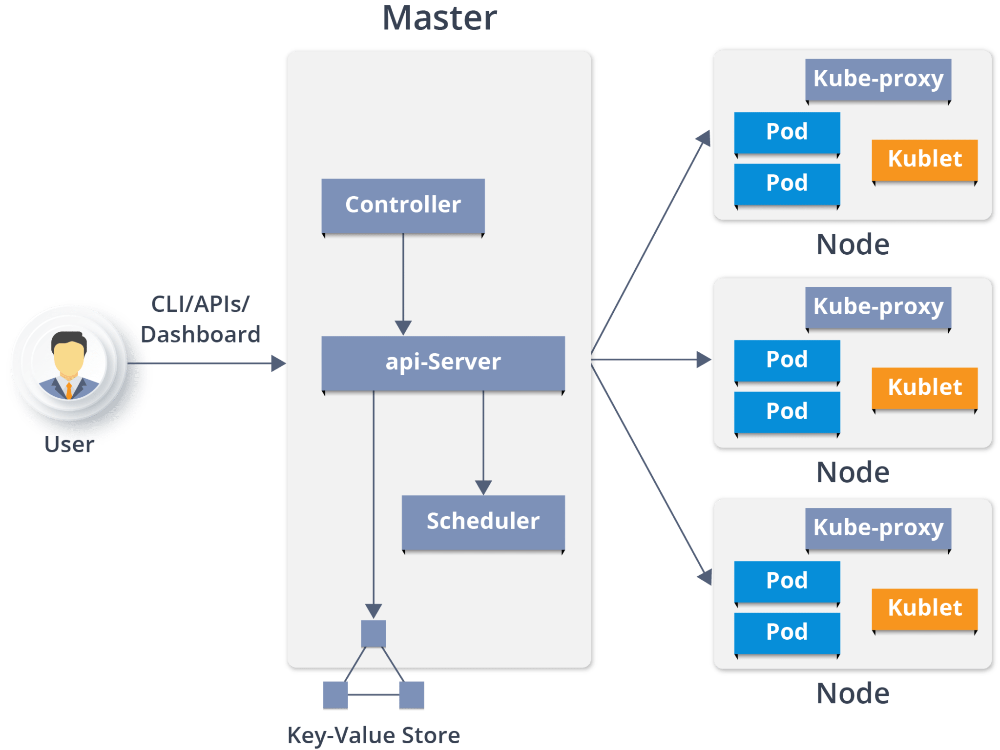

# Kubernetes

Benefits of Kubernetes

- Container orchestration savings, Kubernetes automatically provisions and fits containers into nodes for the best use of resources. Some public cloud platforms charge a management fee for every cluster, so running fewer clusters means fewer API servers and other redundancies and helps lower costs.
- Increased DevOps efficiency for microservices architecture, Container integration and access to storage resources with different cloud providers make development, testing and deployment simpler. Creating container images — which contain everything an application needs to run — is easier and more efficient than creating virtual machine (VM) images. All this means faster development and optimized release and deployment times.
- Deploying workloads in multicloud environments, You used to deploy an application on a virtual machine and point a domain name system (DNS) server to it. Now, among the other benefits of Kubernetes, workloads can exist in a single cloud or be spread easily across multiple cloud services. Kubernetes clusters allow the simple and accelerated migration of containerized applications from on-premises infrastructure to hybrid deployments across any cloud provider’s public cloud or private cloud infrastructure without losing any of an app’s functions or performance.
- More portability with less chance of vendor lock-in. Using containers for your applications provides a lightweight, more agile way to handle virtualization than with virtual machines (VMs). Because containers only contain the resources an application actually needs (i.e., its code, installations and dependencies) and use the features and resources of the host operating system (OS), they are smaller, faster and more portable. For instance, hosting four apps on four virtual machines would generally require four copies of a guest OS to run on that server.
- Automation of deployment and scalability, Kubernetes schedules and automates container deployment across multiple compute nodes, whether on the public cloud, onsite VMs or physical on-premises machines. Its automatic scaling lets teams scale up or down to meet demand faster. Autoscaling starts up new containers as needed for heavy loads or spikes, whether due to CPU usage, memory thresholds or custom metrics — for instance, when an online event launches and there’s a sudden increase in requests.
- App stability and availability in a cloud environment, Kubernetes helps you run your containerized applications reliably. It automatically places and balances containerized workloads and scales clusters appropriately to accommodate increasing demand and keep the system live. If one node in a multi-node cluster fails, the workload is redistributed to others without disrupting availability to users. It also provides self-healing capabilities and will restart, reschedule or replace a container when it fails or when nodes die. It allows you to do rolling updates to your software without downtime. 
- Open-source benefits of Kubernetes, Kubernetes is a community-led project and fully open-source tool (at one time, the fastest-growing open-source software ever), meaning there is a huge ecosystem of other open-source tools designed for use with it. The platform’s strong support means there is continued innovation and improvements to Kubernetes, which protects an investment in the platform, meaning no lock-in to technology that soon becomes outdated.

## Kubernetes architecture



# Seting up Kubernetes K8 on Docker

Go to settings, Kubernetes in the docker desktop app and click on enable. this may take some time and may require you to restart your computer. The following command should tell you if the service is working

```
kubectl get service
```

Kubernetes commands

type the following to get a list of commands
```
kuberctl
```


```
Basic Commands (Beginner):
  create          Create a resource from a file or from stdin
  expose          Take a replication controller, service, deployment or pod and expose it as a new Kubernetes service
  run             Run a particular image on the cluster
  set             Set specific features on objects

Basic Commands (Intermediate):
  explain         Get documentation for a resource
  get             Display one or many resources
  edit            Edit a resource on the server
  delete          Delete resources by file names, stdin, resources and names, or by resources and label selector

Deploy Commands:
  rollout         Manage the rollout of a resource
  scale           Set a new size for a deployment, replica set, or replication controller
  autoscale       Auto-scale a deployment, replica set, stateful set, or replication controller

Cluster Management Commands:
  certificate     Modify certificate resources.
  cluster-info    Display cluster information
  top             Display resource (CPU/memory) usage
  cordon          Mark node as unschedulable
  uncordon        Mark node as schedulable
  drain           Drain node in preparation for maintenance
  taint           Update the taints on one or more nodes

Troubleshooting and Debugging Commands:
  describe        Show details of a specific resource or group of resources
  logs            Print the logs for a container in a pod
  attach          Attach to a running container
  exec            Execute a command in a container
  port-forward    Forward one or more local ports to a pod
  proxy           Run a proxy to the Kubernetes API server
  cp              Copy files and directories to and from containers
  auth            Inspect authorization
  debug           Create debugging sessions for troubleshooting workloads and nodes

Advanced Commands:
  diff            Diff the live version against a would-be applied version
  apply           Apply a configuration to a resource by file name or stdin
  patch           Update fields of a resource
  replace         Replace a resource by file name or stdin
  wait            Experimental: Wait for a specific condition on one or many resources
  kustomize       Build a kustomization target from a directory or URL.

Settings Commands:
  label           Update the labels on a resource
  annotate        Update the annotations on a resource
  completion      Output shell completion code for the specified shell (bash, zsh, fish, or powershell)

Other Commands:
  alpha           Commands for features in alpha
  api-resources   Print the supported API resources on the server
  api-versions    Print the supported API versions on the server, in the form of "group/version"
  config          Modify kubeconfig files
  plugin          Provides utilities for interacting with plugins
  version         Print the client and server version information

Usage:
  kubectl [flags] [options]

Use "kubectl <command> --help" for more information about a given command.
Use "kubectl options" for a list of global command-line options (applies to all commands).
```