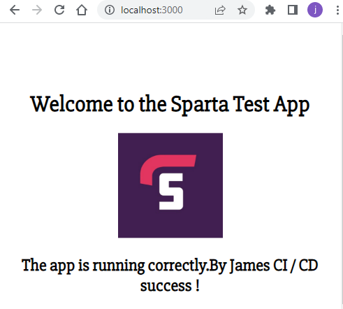

# Setting up your node App

To set up our node app, we need to start a new directory as our working directory and then copy over the app directory from tech201_virtualisation which contains all of our app files.

next to this directory we need another Dockerfile and the contents need to specify what we need for our image. Firstly specifying the latest version of node from dockerhub. The `WORKDIR` can be used to specify our working directory and then copy accross the source code from the app directory with `COPY app /usr/src/app`. Copythe .json file and `RUN npm install`.
Finally Expose port 3000 and CMD ["npm","start"] to set our localhost ip address and start node there, containing our app files.

```
# from which image
FROM node:latest

# label
LABEL MAINTAINER=jcole@spartaglobal

#RUN mkdir -p /usr/src/app
#WRKDIR /usr/src/app
WORKDIR /usr/src/app
# copy data app folder
COPY app /usr/src/app/

COPY package*.json ./

# install dependncies npm
RUN npm install

# expose port
EXPOSE 3000
# CMD [node app.js or nmp start]
CMD ["npm","start"]
```

Then we can build our nodeapp, make a new repo on your dockerhub and use these details to build the node app.

```
docker build -t username/repo:tag .
```

now to start the nodeup we can use `docker run`
```
docker run -d -p 3000:3000 username/repo:tag
```

Finally push the files to dockerhub

```
docker push username/repo:tag
```



## Setting up your node app on AWS with docker image

### Install Docker

```
curl -fsSL https://get.docker.com -o get-docker.sh

sudo sh get-docker.sh
```

### Install nginx

```
docker pull jamestcole/tech201-nginx:v1

sudo docker run -d -p 80:80 jamestcole/tech201-nginx:v1
```

### Install node

```
docker pull jamestcole/nodeapp-tech201-james:v1

sudo docker run -d -p 80:80 jamestcole/nodeapp-tech201-james:v1
```
